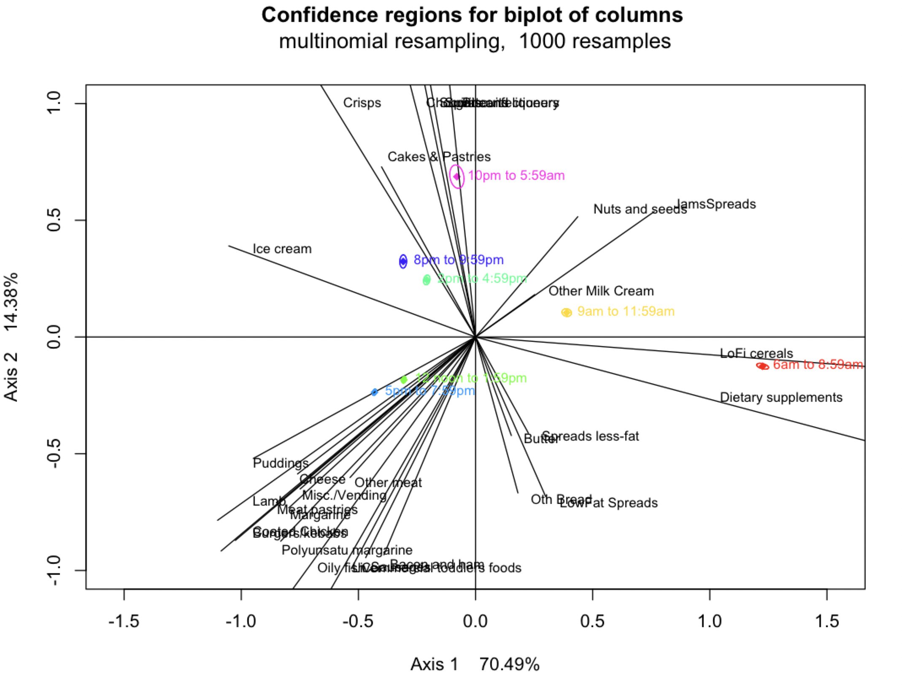

```{r setup, include=FALSE}
knitr::opts_chunk$set(echo = TRUE)
library(knitr)
library(kableExtra)
library(tidyverse)
```

# Pre-CA analyses

## Summary statistics 

In this section, we look at some of the summary statistics for our NDNS RP (9 year) dataset in adults (age >= 19 y.o.). After excluding food recordings from young participants, there were 749,026 recordings of food entry written by the 6802 pariticipants.

### numbers of food entries by time slots (7 or 3 groups)

```{r cache=TRUE}

load("../Food1_9_adlt_labl.Rdata")

Food1_9_adlt %>% 
  ungroup() %>% 
  group_by(MealTimeSlot) %>% 
  summarise(n = n()) %>% 
  mutate(relfreq = n/sum(n)) %>% 
  mutate(rel.freq = paste0(round(100 * n/sum(n), 3), "%"))  %>% 
  mutate(cum.freq = paste0(round(100 * cumsum(relfreq), 3), "%")) %>% 
  print(n=Inf)


Food1_9_adlt %>% 
  ungroup() %>% 
  group_by(Time3g) %>% 
  summarise(n = n()) %>% 
  mutate(relfreq = n/sum(n)) %>% 
  mutate(rel.freq = paste0(round(100 * n/sum(n), 3), "%"))  %>% 
  mutate(cum.freq = paste0(round(100 * cumsum(relfreq), 3), "%")) %>% 
  print(n=Inf)

```

### Days of week collected in the dataset

```{r cache=TRUE}
Food1_9_adlt %>% 
  mutate(DayofWeek = factor(DayofWeek, levels = c("Monday",
                                                  "Tuesday",
                                                  "Wednesday",
                                                  "Thursday",
                                                  "Friday", 
                                                  "Saturday",
                                                  "Sunday"))) %>% 
  ungroup() %>% 
  group_by(DayofWeek) %>% 
  summarise(n = n()) %>% 
  mutate(relfreq = n/sum(n)) %>% 
  mutate(rel.freq = paste0(round(100 * n/sum(n), 3), "%"))  %>% 
  mutate(cum.freq = paste0(round(100 * cumsum(relfreq), 3), "%")) %>% 
  print(n=Inf)
```


### Sex and age

The participants were:

- 2810 men (sex = 1) and 
- 3992 women (sex = 2) aged 19 or above.

```{r cache=TRUE}
load("../Indiv1_9_adlt.Rdata")
Indiv1_9_adlt$Sex <- factor(Indiv1_9_adlt$Sex)
Indiv1_9_adlt %>% 
  group_by(Sex) %>% 
  summarise(Meanage = mean(age), 
            SDage = sd(age))

ggplot(Indiv1_9_adlt, aes(x=age, fill = Sex, color = Sex)) + 
 geom_histogram(aes(y=..density..), colour="black", fill="white", binwidth = 2)+
 geom_density(alpha=.2) 
```

### Diabetes status

In all 9 years data combined, there were:

- 227 diabetes patients   (DM4cat = 3);
- 99 undiagnosed diabetes (DM4cat = 2);
- 133 prediabetes         (DM4cat = 1);
- 2626 non-diabetes participants (DM4cat = 0);
- 3717 missing values.


```{r cache=TRUE}
load("../Indiv1_9_adlt.Rdata")

Indiv1_9_adlt %>% 
  group_by(DM4cat) %>% 
  summarise(n = n()) %>% 
  mutate(rel.freq = paste0(round(100 * n/sum(n), 2), "%"))  %>% 
  print(n=Inf)
```

### Social economic status

121 pariticipants' socio-economic classification were missing.

```{r}
library(naniar)

Indiv1_9_adlt %>% 
  replace_with_na(replace = list(nssec8 = -9)) %>% 
  group_by(nssec8) %>% 
  summarise(n = n()) %>% 
  mutate(relfreq = n/sum(n)) %>% 
  mutate(rel.freq = paste0(round(100 * n/sum(n), 3), "%"))  %>% 
  mutate(cum.freq = paste0(round(100 * cumsum(relfreq), 3), "%")) %>% 
  print(n=Inf)
```

## Food groups 

All 60 food groups sorted by the percentage contributed to the total calories consumed by participants. We can see 13 food groups contributed 50% of total energy that these pariticipants consumed, 28 food groups contributed 80% of total energy that these people consumed. 

```{r}
TableFoogGroup <- Food1_9_adlt %>% 
  ungroup() %>% 
  group_by(mfgLab) %>% 
  summarise(n = n(), meanHpoint = mean(H_points, na.rm = T), mfgCalories = sum(Energykcal)) %>% 
  arrange(-mfgCalories) %>% 
  mutate(n.freq = paste0(round(100 * n/sum(n), 2), "%"))  %>% 
  mutate(cal.Prop = paste0(round(100 * mfgCalories/sum(mfgCalories), 2), "%"))  %>% 
  mutate(calprop = mfgCalories/sum(mfgCalories)) %>% 
  mutate(calcumprop = paste0(round(100 * cumsum(calprop), 3), "%")) %>% 
  select(-calprop) %>% 
  print(n=Inf)

```

### Healthy point definition by (Pechey et al, 2013)


#### Healthy foods (n = 3) meanHpoint < -2

```{r, cache=TRUE}
TableFoogGroup <- TableFoogGroup %>% 
  mutate(healthy     = meanHpoint < -2, 
         lesshealthy = meanHpoint > 4, 
         neutral     = (meanHpoint <= 4) & (meanHpoint >= -2))

TableFoogGroup %>% 
  filter(healthy) %>% 
  select(-lesshealthy, -neutral,-calcumprop)
```

#### Neutral foods (n = 26); meanHpoint between (-2, 4)

```{r, cache=TRUE}
TableFoogGroup %>% 
  filter(neutral) %>% 
  select(-lesshealthy, -healthy, -calcumprop) %>% 
  print(n=Inf)
```

#### Less Healthy foods (n = 31); meanHpoint > 4


```{r}
TableFoogGroup %>% 
  filter(lesshealthy) %>% 
  select(-neutral, -healthy, -calcumprop) %>% 
  print(n=Inf)
```


### Healthy point definition by tertiles of meanHpoint

```{r}
TableFoogGroup <- TableFoogGroup %>% 
  mutate(HealthPoints3g = ntile(meanHpoint, 3))
```


#### Healthy foods Group 1 (n = 20)

```{r, cache=TRUE}
TableFoogGroup %>% 
  filter(HealthPoints3g == 1) %>% 
  select(-lesshealthy, -neutral,-calcumprop, -healthy, -HealthPoints3g) %>% 
  print(n=Inf)
```


#### Healthy foods Group 2 (n = 20)

```{r, cache=TRUE}
TableFoogGroup %>% 
  filter(HealthPoints3g == 2) %>% 
  select(-lesshealthy, -neutral,-calcumprop, -healthy, -HealthPoints3g)
```

#### Healthy foods Group 3 (n = 20)

```{r, cache=TRUE}
TableFoogGroup %>% 
  filter(HealthPoints3g == 3) %>% 
  select(-lesshealthy, -neutral,-calcumprop, -healthy, -HealthPoints3g)
```


# CA analysis in all adults


## All food group and 7 Eating Time slots


### Contingency table of food groups and time slots:

Note that we have randomly splitted the food recording data sets into two subsets. From here we are using only the data set 1 for hypothesis generation.

```{r, message=FALSE}
library(FactoMineR)
library(factoextra)
load("../HFood.Rdata")
freqtab <- xtabs(~HFood$mfgLab + HFood$MealTimeSlot)
as.data.frame.matrix(freqtab) %>%
  kable() %>%
  kable_styling(bootstrap_options = c("striped", "hover"))
```

### Foods and 7 Eating Time Slots

```{r cache=TRUE, fig.cap="Scree plot -- CA of the NDNS RP 9 year data, eating time slots and food goups."}
res.ca <- CA(as.data.frame.matrix(freqtab), graph = FALSE)
fviz_screeplot(res.ca, addlabels = TRUE)
```


First two dimensions represents `r 68.9 + 15.3`% of the inertia (variation in time slots profile).


```{r fig.height=6, fig.width=8, cache=TRUE}
fviz_ca_biplot(res.ca, repel = TRUE, title = "Biplot of Correspondence analysis for 60 food groups.") 
```


- The horizontal axis contrasts the early time (am, and earlier than 6 am included) with later time (noon, afternoon, till 10 pm); and breakfast foods with the others.

- The vertical axis shows large contribution from alcohol against the others. 

### Biplot by food healthiness (1)

#### Three healthy food only

```{r fig.height=6, fig.width=8, cache=TRUE}
HealthyFoods <- as.data.frame.matrix(freqtab)[rownames(as.data.frame.matrix(freqtab)) %in% c("Veg not raw", "Fruit", "Salad and raw veg"),]

Healthy.ca <- CA(HealthyFoods, graph = FALSE)
fviz_ca_biplot(Healthy.ca, 
               repel = TRUE, title = "Biplot of Correspondence analysis for 3 healthy food groups.") 
```

#### with confidence region (1000 bootstrapping method)
```{r cache=TRUE, include=FALSE, eval=FALSE}
# extract recordings for healthy foods
Hthy <- as.logical(HFood$HealthFoodGr == "Healthy")
Htab <- xtabs(~HFood$mfgLab + HFood$MealTimeSlot, subset = Hthy)
library(cabootcrs) 
Hmatrix <- matrix(data = Htab, nrow = 3, ncol = 7, 
                  dimnames = list(rownames(Htab), colnames(Htab)))
Hcaboot <- cabootcrs(Hmatrix, resampledistn = "multinomial")
```

```{r ConfidenceRegion00, echo=FALSE, fig.height=6, fig.width=8, cache=TRUE, fig.cap="Healthy Foods with bootstrap 95% confidence regions for Food groups.", fig.align='center'}

```

```{r ConfidenceRegion01, echo=FALSE, fig.height=6, fig.width=8, cache=TRUE, fig.cap="Healthy Foods with bootstrap 95% confidence regions for Time Slots.", fig.align='center'}
knitr::include_graphics("fig/BootstrapCR01.png")
```


#### Neutral food (n = 26)

```{r fig.height=6, fig.width=8, cache=TRUE}
NeutralFoods <- as.data.frame.matrix(freqtab)[rownames(as.data.frame.matrix(freqtab)) %in% TableFoogGroup$mfgLab[TableFoogGroup$neutral],]

Neutral.ca <- CA(NeutralFoods, graph = FALSE)
fviz_ca_biplot(Neutral.ca, 
               repel = TRUE, title = "Biplot of Correspondence analysis for 26 neutral food groups.") 
```

#### with confidence region (1000 bootstrapping method)


```{r cache=TRUE, include=FALSE, eval=FALSE}
# extract recordings for Neutral foods
Neut <- as.logical(HFood$HealthFoodGr == "Neutral")
Ntab <- xtabs(~HFood$mfgLab + HFood$MealTimeSlot, subset = Neut)

Nmatrix <- matrix(data = Ntab, nrow = 26, ncol = 7, 
                  dimnames = list(rownames(Ntab), colnames(Ntab)))
Ncaboot <- cabootcrs(Nmatrix, resampledistn = "multinomial")
```

```{r ConfidenceRegion02, echo=FALSE, fig.height=6, fig.width=8, cache=TRUE, fig.cap="Neutral Foods with bootstrap 95% confidence regions for Food groups.", fig.align='center'}

```

```{r ConfidenceRegion03, echo=FALSE, fig.height=6, fig.width=8, cache=TRUE, fig.cap="Neutral Foods with bootstrap 95% confidence regions for Time Slots.", fig.align='center'}

```


#### less healthy food (n = 31)

```{r fig.height=6, fig.width=8, cache=TRUE}
LessFoods <- as.data.frame.matrix(freqtab)[rownames(as.data.frame.matrix(freqtab)) %in% TableFoogGroup$mfgLab[TableFoogGroup$lesshealthy],]

Less.ca <- CA(LessFoods, graph = FALSE)
fviz_ca_biplot(Less.ca, 
               repel = TRUE, title = "Biplot of Correspondence analysis for 31 less healthy food groups.") 
```


#### with confidence region (1000 bootstrapping method)


```{r cache=TRUE, include=FALSE, eval=FALSE}
# extract recordings for less healthy foods
LessHthy <- as.logical(HFood$HealthFoodGr == "LessHealthy")
Ltab <- xtabs(~HFood$mfgLab + HFood$MealTimeSlot, subset = LessHthy)

Lmatrix <- matrix(data = Ltab, nrow = 31, ncol = 7, 
                  dimnames = list(rownames(Ltab), colnames(Ltab)))
Lcaboot <- cabootcrs(Lmatrix, resampledistn = "multinomial")
```

```{r ConfidenceRegion04, echo=FALSE, fig.height=6, fig.width=8, cache=TRUE, fig.cap="Less Healthy Foods with bootstrap 95% confidence regions for Food groups.", fig.align='center'}

```

```{r ConfidenceRegion05, echo=FALSE, fig.height=6, fig.width=8, cache=TRUE, fig.cap="Less Healthy Foods with bootstrap 95% confidence regions for Time Slots.", fig.align='center'}

```

### Biplot by food healthiness (2)

#### Food Healthiness Group 1

```{r fig.height=6, fig.width=8, cache=TRUE}
G1Foods <- as.data.frame.matrix(freqtab)[rownames(as.data.frame.matrix(freqtab)) %in% TableFoogGroup$mfgLab[TableFoogGroup$HealthPoints3g == 1],]

G1.ca <- CA(G1Foods, graph = FALSE)
fviz_ca_biplot(G1.ca, 
               repel = TRUE, title = "Biplot of Correspondence analysis for food group 1 (1st 20 healthy foods).") 
```


#### with confidence region (1000 bootstrapping method)
```{r cache=TRUE, include=FALSE, eval=FALSE}
Hcaboot <- cabootcrs(G1Foods, resampledistn = "multinomial")
```

```{r ConfidenceRegion06, echo=FALSE, fig.height=6, fig.width=8, cache=TRUE, fig.cap="Healthy Foods (first 20 groups) with bootstrap 95% confidence regions for Food groups.", fig.align='center'}

```

```{r ConfidenceRegion07, echo=FALSE, fig.height=6, fig.width=8, cache=TRUE, fig.cap="Healthy Foods (first 20 groups) with bootstrap 95% confidence regions for Time Slots.", fig.align='center'}

```

#### Food Healthiness Group 2

```{r fig.height=6, fig.width=8, cache=TRUE}
G2Foods <- as.data.frame.matrix(freqtab)[rownames(as.data.frame.matrix(freqtab)) %in% TableFoogGroup$mfgLab[TableFoogGroup$HealthPoints3g == 2],]

G2.ca <- CA(G2Foods, graph = FALSE)
fviz_ca_biplot(G2.ca, 
               repel = TRUE, title = "Biplot of Correspondence analysis for food group 2 (2nd 20 healthy foods).") 
```


#### with confidence region (1000 bootstrapping method)
```{r cache=TRUE, include=FALSE, eval=FALSE}
Hcaboot <- cabootcrs(G2Foods, resampledistn = "multinomial")
```

```{r ConfidenceRegion08, echo=FALSE, fig.height=6, fig.width=8, cache=TRUE, fig.cap="Healthy Foods (middle 20 groups) with bootstrap 95% confidence regions for Food groups.", fig.align='center'}

```

```{r ConfidenceRegion09, echo=FALSE, fig.height=6, fig.width=8, cache=TRUE, fig.cap="Healthy Foods (middle 20 groups) with bootstrap 95% confidence regions for Time Slots.", fig.align='center'}

```


#### Food Healthiness Group 3

```{r fig.height=6, fig.width=8, cache=TRUE}
G3Foods <- as.data.frame.matrix(freqtab)[rownames(as.data.frame.matrix(freqtab)) %in% TableFoogGroup$mfgLab[TableFoogGroup$HealthPoints3g == 3],]

G3.ca <- CA(G3Foods, graph = FALSE)
fviz_ca_biplot(G3.ca, 
               repel = TRUE, title = "Biplot of Correspondence analysis for food group 3 (3rd 20 healthy foods).") 
```


# CA analysis by diabetes status 

## among diagnosed diabetes patients

```{r fig.height=6, fig.width=8, cache=TRUE}
DiagDM <- as.logical(HFood$DM4cat.y == 3)
DiagDMtab <- xtabs(~HFood$mfgLab + HFood$MealTimeSlot, subset = DiagDM)
DiagDMmatrix <- matrix(data = DiagDMtab, nrow = 59, ncol = 7, 
                  dimnames = list(rownames(DiagDMtab), colnames(DiagDMtab)))

DiagDM.ca <- CA(DiagDMmatrix, graph = FALSE)
fviz_ca_biplot(DiagDM.ca, 
               repel = TRUE, title = "Biplot of Correspondence analysis among diagnosed DM.") 
```


### Three healthy food only

```{r fig.height=6, fig.width=8, cache=TRUE}

HealthyFoods <- as.data.frame.matrix(DiagDMtab)[rownames(as.data.frame.matrix(DiagDMtab)) %in% c("Veg not raw", "Fruit", "Salad and raw veg"),]

Healthy.ca <- CA(HealthyFoods, graph = FALSE)
fviz_ca_biplot(Healthy.ca, 
               repel = TRUE, title = "Biplot of CA for 3 healthy food groups in DM patients.") 
```

### With confidence region 

```{r ConfidenceRegion10, echo=FALSE, fig.height=6, fig.width=8, cache=TRUE, fig.cap="Healthy Foods with bootstrap 95% confidence regions for Food groups.", fig.align='center'}

```

```{r ConfidenceRegion11, echo=FALSE, fig.height=6, fig.width=8, cache=TRUE, fig.cap="Healthy Foods with bootstrap 95% confidence regions for Time Slots.", fig.align='center'}
knitr::include_graphics("fig/BootstrapCR12.png")
```

## among non-diabete participants

```{r fig.height=6, fig.width=8, cache=TRUE}
DiagDM <- as.logical(HFood$DM4cat.y == 0)
DiagDMtab <- xtabs(~HFood$mfgLab + HFood$MealTimeSlot, subset = DiagDM)
DiagDMmatrix <- matrix(data = DiagDMtab, nrow = 60, ncol = 7, 
                  dimnames = list(rownames(DiagDMtab), colnames(DiagDMtab)))

DiagDM.ca <- CA(DiagDMmatrix, graph = FALSE)
fviz_ca_biplot(DiagDM.ca, 
               repel = TRUE, title = "Biplot of Correspondence analysis among non-diabete participants.") 
```


## among Pre-diabetes participants

```{r fig.height=6, fig.width=8, cache=TRUE}
DiagDM <- as.logical(HFood$DM4cat.y == 1)
DiagDMtab <- xtabs(~HFood$mfgLab + HFood$MealTimeSlot, subset = DiagDM)
DiagDMmatrix <- matrix(data = DiagDMtab, nrow = 59, ncol = 7, 
                  dimnames = list(rownames(DiagDMtab), colnames(DiagDMtab)))

DiagDM.ca <- CA(DiagDMmatrix, graph = FALSE)
fviz_ca_biplot(DiagDM.ca, 
               repel = TRUE, title = "Biplot of Correspondence analysis among Prediabetes participants.") 
```


## among undiagnosed-diabetes participants

```{r fig.height=6, fig.width=8, cache=TRUE}
DiagDM <- as.logical(HFood$DM4cat.y == 2)
DiagDMtab <- xtabs(~HFood$mfgLab + HFood$MealTimeSlot, subset = DiagDM)
DiagDMmatrix <- matrix(data = DiagDMtab, nrow = 59, ncol = 7, 
                  dimnames = list(rownames(DiagDMtab), colnames(DiagDMtab)))

DiagDM.ca <- CA(DiagDMmatrix, graph = FALSE)
fviz_ca_biplot(DiagDM.ca, 
               repel = TRUE, title = "Biplot of Correspondence analysis among undiagnosed DM participants.") 
```